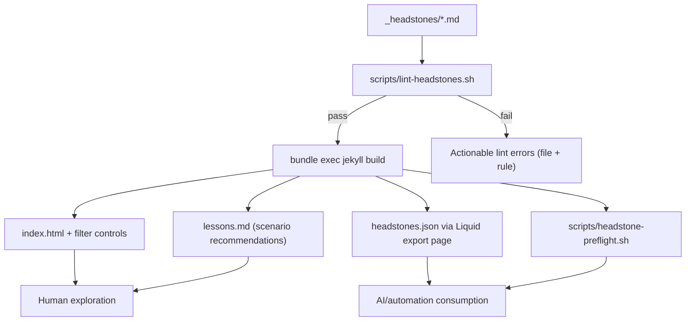
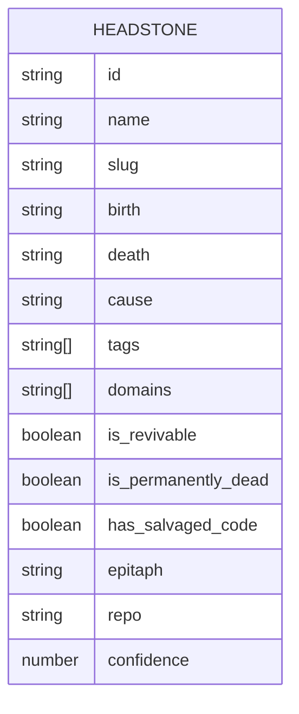

# feat: Add schema-validated headstone intelligence layer

## Table of Contents
- [Overview](#overview)
- [Problem Statement](#problem-statement)
- [Proposed Solution](#proposed-solution)
- [Technical Approach](#technical-approach)
  - [Architecture](#architecture)
  - [Implementation Phases](#implementation-phases)
- [Alternative Approaches Considered](#alternative-approaches-considered)
- [System-Wide Impact](#system-wide-impact)
- [Acceptance Criteria](#acceptance-criteria)
- [Success Metrics](#success-metrics)
- [Dependencies & Prerequisites](#dependencies--prerequisites)
- [Risk Analysis & Mitigation](#risk-analysis--mitigation)
- [Premortem (Six-Month Failure Scenario)](#premortem-six-month-failure-scenario)
- [Plan Revisions from Premortem](#plan-revisions-from-premortem)
- [Resource Requirements](#resource-requirements)
- [Future Considerations](#future-considerations)
- [Documentation Plan](#documentation-plan)
- [AI-Era Implementation Notes](#ai-era-implementation-notes)
- [Technical Review Outcomes](#technical-review-outcomes)
- [Sources & References](#sources--references)
- [Deepen Addendum (command fallback)](#deepen-addendum-command-fallback)

## Overview
Create a cohesive “headstone intelligence layer” for the Unfinished Cemetery so both humans and AI agents can browse, learn, and reason over project postmortems reliably. Scope includes strict schema linting, controlled cause taxonomy, richer filtered discovery, a lessons index, machine-readable export, standardized “What survived” content, and a project viability pre-flight checklist.

## Problem Statement
Current repository patterns are strong but implicit:
- No enforced schema/lint for `_headstones/*.md`
- Cause taxonomy drift exists (`complexity` appears in content but is not consistently mapped in UI branches)
- No filter UI beyond archived logic in `/index.html`
- No dedicated lessons index
- No `/headstones.json` export
- “What survived” exists in only one headstone
- No cemetery-pattern pre-flight checker for new project ideas

This limits discoverability, consistency, and machine-readability.

## Proposed Solution
Implement a phased feature bundle anchored on one canonical content contract:
1. **Schema + lint foundation** (required frontmatter + required sections + controlled enums)
2. **Discovery layer** (multi-dimension filters + lessons index)
3. **Machine interface** (`/headstones.json` normalized export)
4. **Decision support** (pre-flight viability CLI/report)

Default posture: strict for new/edited content, migration-compatible for legacy content during transition.

## Technical Approach

### Architecture

#### Data contract model (content-level, no DB migration required)

### Implementation Phases

#### Phase 1: Foundation — Schema, taxonomy, and migration safety

**Deliverables**
- `_data/headstone-schema.yml`: single source for required keys, enums, and heading aliases
- `_data/headstone-taxonomy.yml`: single source for cause labels, classes, and colors
- `scripts/lint-headstones.sh`: schema + section lint checks
- `scripts/migrate-headstones.sh`: backfill/normalize legacy frontmatter and headings
- `docs/headstone-schema.md`: canonical contract + taxonomy definitions
- `docs/headstone-migration.md`: compatibility aliases and migration rules
- Update cause mappings:
  - `/Users/jamiecraik/dev/unfinished-cemetery/_layouts/headstone.html`
  - `/Users/jamiecraik/dev/unfinished-cemetery/assets/css/main.scss`
- Add validation command references to:
  - `/Users/jamiecraik/dev/unfinished-cemetery/docs/agents/04-validation.md`
- Add lint gate to:
  - `/Users/jamiecraik/dev/unfinished-cemetery/.github/workflows/ci-tests.yml`
  - `/Users/jamiecraik/dev/unfinished-cemetery/.github/workflows/pages.yml`

**Tasks (file-scoped)**
- [x] Define required frontmatter, optional fields, and enums in `_data/headstone-schema.yml` + `docs/headstone-schema.md`
- [x] Define centralized cause mappings in `_data/headstone-taxonomy.yml`
- [x] Enforce required markdown sections and enum checks in `scripts/lint-headstones.sh` (read from `_data/headstone-schema.yml`)
- [x] Add one-time/iterative normalization in `scripts/migrate-headstones.sh --apply`
- [x] Refactor `_layouts/headstone.html` to consume taxonomy mapping
- [x] Refactor `assets/css/main.scss` cause coverage to match taxonomy mapping
- [x] Document legacy heading aliases + deprecation window in `docs/headstone-migration.md`
- [x] Add lint commands to `.github/workflows/ci-tests.yml` and `.github/workflows/pages.yml` before Jekyll build

**Estimated effort**: 1–2 days

#### Phase 2: Discovery — Deterministic filters, lessons index, and machine-readable export

**Deliverables**
- Enhanced `/Users/jamiecraik/dev/unfinished-cemetery/index.html` filter controls
- New `/Users/jamiecraik/dev/unfinished-cemetery/assets/js/filters.js` for non-destructive client filtering
- New `/Users/jamiecraik/dev/unfinished-cemetery/lessons.md` route (scenario-to-top-3 deterministic recommendations)
- New `/Users/jamiecraik/dev/unfinished-cemetery/headstones.json` endpoint (Jekyll-generated)

**Tasks (file-scoped)**
- [ ] Add initial filter chips/controls in `index.html` for cause, duration, and `has_salvaged_code`
- [ ] Add staged rollout hooks for `domains`, `is_revivable`, and `is_permanently_dead` after metadata-quality gate passes
- [ ] Add no-result fallback UX and clear-filter action in `assets/js/filters.js`
- [ ] Create lessons index page logic in `lessons.md` (deterministic top-3 selection + rationale output)
- [ ] Add normalized export contract in `headstones.json` (id/slug/tags/lessons/antiPatterns/confidence + stable sorting)
- [ ] Add nav entry for Lessons in `_includes/header.html`

**Estimated effort**: 2–3 days

#### Phase 3: Decision support + quality hardening

**Deliverables**
- `scripts/headstone-preflight.sh`: project viability checklist report (`--experimental-scoring` optional flag)
- Standardized “What survived” section across `_headstones/*.md`
- CI/local validation runbook updates in docs

**Tasks (file-scoped)**
- [ ] Implement baseline pass/warn/fail checks in `scripts/headstone-preflight.sh`
- [ ] Implement optional weighted scoring path behind `--experimental-scoring`
- [ ] Backfill `## What Survived` content in each file under `_headstones/`
- [ ] Add command examples + expected outputs to `README.md`
- [ ] Add preflight command to `docs/agents/04-validation.md`

**Estimated effort**: 1–2 days

## Alternative Approaches Considered
1. **Big-bang rewrite (rejected):** Fastest to conceptualize, highest break risk.
2. **Strict-only from day one (rejected):** Blocks progress due to legacy heading drift.
3. **Recommended: staged strictness with migration aliasing:** Preserves delivery speed while converging on a reliable schema.

## System-Wide Impact

### Interaction Graph
Author edits `_headstones/*.md` → lint script validates structure/taxonomy → Jekyll builds pages/export → index and lessons consume normalized fields → preflight uses same normalized data for viability output.

### Error & Failure Propagation
- **Lint failure**: stops local/CI pipeline before build.
- **Build failure**: blocks deploy; root cause traced to invalid Liquid/data shape.
- **Filter logic failure**: should degrade to unfiltered list (no blank page).
- **JSON export shape failure**: must fail validation if required fields missing.

### State Lifecycle Risks
No persistent database state. Main risk is content-state drift (frontmatter/section mismatch). Mitigated by lint + migration aliases + explicit deprecation timeline.

### API Surface Parity
Equivalent surface areas that must remain aligned:
- Card rendering (`index.html`)
- Detail rendering (`_layouts/headstone.html`)
- Lessons ranking (`lessons.md`)
- Machine output (`headstones.json`)
- Preflight script (`scripts/headstone-preflight.sh`)
- Canonical schema + taxonomy (`_data/headstone-schema.yml`, `_data/headstone-taxonomy.yml`)

### Integration Test Scenarios
1. Lint fail for unknown cause in `_headstones/example.md`
2. Filter intersections produce stable empty-state UX
3. Lessons route returns exactly 3 recs when ≥3 candidates exist
4. `/headstones.json` remains deterministic across unchanged builds
5. Preflight score changes predictably when a headstone’s risk metadata changes

## Acceptance Criteria

### Functional Requirements
- [ ] Every new/edited headstone must pass schema and section lint.
- [ ] Controlled cause taxonomy has exhaustive UI mappings.
- [ ] Index supports filter combinations for all requested dimensions.
- [ ] Lessons page provides scenario-guided top-3 recommendations.
- [ ] `/headstones.json` exposes normalized stable schema.
- [ ] Preflight script emits pass/warn/fail checks and (optional) viability score + risk actions.
- [ ] All headstones include `## What Survived` section.

### Non-Functional Requirements
- [ ] Build remains compatible with GitHub Pages Jekyll flow.
- [ ] Filter UX remains usable on mobile and with reduced motion settings.
- [ ] Feature additions do not require external services for core operation.
- [ ] Filter experience remains understandable with very small datasets (<=10 headstones).

### Quality Gates
- [ ] `bundle exec jekyll build` passes.
- [ ] `jq -e . _data/archived_repos.json` passes.
- [ ] New lint command passes on full `_headstones/` corpus.
- [ ] `.github/workflows/ci-tests.yml` runs lint before `bundle exec jekyll build`.
- [ ] `.github/workflows/pages.yml` runs lint before deploy build.
- [ ] `scripts/migrate-headstones.sh --dry-run` shows zero destructive rewrites before `--apply`.
- [ ] `/headstones.json` includes `schema_version` and deterministic sort.
- [ ] Plan docs and schema docs include Table of Contents.

## Success Metrics
- 100% headstones pass schema lint in CI.
- 0 unmapped cause values in UI branches.
- ≥80% of headstone pages include meaningful “What Survived” bullet content in first migration pass.
- `/headstones.json` consumed successfully by at least one automation/script.
- Preflight report used in at least 3 new-project decisions.
- Recommendation rationale judged “useful/trustworthy” in manual review for at least 4 of first 5 scenarios.
- No more than 1 false-positive lint blocker per week after strict mode activation.

## Dependencies & Prerequisites
- Existing Bundler/Jekyll toolchain (`Gemfile`, `Gemfile.lock`)
- Existing scripts convention under `/Users/jamiecraik/dev/unfinished-cemetery/scripts/`
- Agreement on canonical cause taxonomy and `is_revivable`/`is_permanently_dead` semantics
- Decision on confidence scoring method (manual field vs rule-derived)
- Existing workflow pipelines under `/Users/jamiecraik/dev/unfinished-cemetery/.github/workflows/`

## Risk Analysis & Mitigation
- **Taxonomy drift risk** → single canonical enum + lint enforcement.
- **Legacy content migration risk** → alias period + explicit migration checklist.
- **Overfitting recommendation logic** → deterministic transparent scoring and rationale output.
- **JS dependency risk** → graceful fallback to unfiltered server-rendered list.
- **Schema/spec overreach risk** → phase-gate advanced scoring as opt-in until at least one consumer validates usefulness.

## Premortem (Six-Month Failure Scenario)
If this plan fails by September 2026, likely causes are:

1. **Metadata burden broke contributor flow.**  
   Assumption that authors will maintain many new fields (`domains`, `confidence`, survivability flags) turns out false. Headstones become partially filled or stale.

2. **“Intelligence” outpaced signal quality.**  
   With a small corpus, recommendations and viability scores feel arbitrary, causing distrust and low usage.

3. **Schema churn broke integrations.**  
   `/headstones.json` changes shape during iteration without versioning; automation consumers fail silently.

4. **Migration damaged narrative quality.**  
   Bulk normalization scripts over-edit authored prose/section headings and reduce the emotional authenticity of entries.

5. **Filter UX became confusing.**  
   Too many dimensions on a small dataset produce empty states and unclear outcomes, hurting usefulness for humans.

6. **CI friction triggered bypass behavior.**  
   Lint false positives or strictness too early causes frequent blocked commits; maintainers bypass or disable checks.

7. **Integration coupling regressed repeatedly.**  
   Cause mapping diverges again across Liquid, CSS, JS, and JSON contract because ownership is unclear.

## Plan Revisions from Premortem
To reduce likely failure modes, apply these guardrails:

1. **Adopt a two-tier schema (Core vs Extended).**  
   - **Core required now:** `name`, `birth`, `death`, `cause`, `tags`, `epitaph`, `What Survived`.  
   - **Extended optional until corpus >=20:** `domains`, `confidence`, `is_revivable`, `is_permanently_dead`, `has_salvaged_code`.

2. **Gate advanced features behind readiness checks.**  
   - Keep Phase 2 recommendation logic deterministic but simple.  
   - Keep weighted viability scoring experimental until at least one user workflow relies on it.

3. **Version and validate machine contracts from day one.**  
   - Add `schema_version` to `/headstones.json`.  
   - Maintain a changelog entry for every contract change.

4. **Protect authored narrative during migration.**  
   - `scripts/migrate-headstones.sh` must support `--dry-run` and emit proposed diffs.  
   - Manual approval required before `--apply`.

5. **Simplify initial filter UX.**  
   - Launch with cause + duration + salvaged filters first.  
   - Add domain/revivability filters only after content backfill reaches quality threshold.

6. **Define ownership to avoid mapping drift.**  
   - Canonical owner files: `_data/headstone-schema.yml` and `_data/headstone-taxonomy.yml`.  
   - Any UI/JSON changes must reference these as source-of-truth.

7. **Add “trust checks” for user experience.**  
   - Require rationale text for each recommendation.  
   - Add one manual “would I trust this suggestion?” review step per release.

## Resource Requirements
- 1 maintainer with Liquid + shell scripting familiarity
- Optional reviewer for content taxonomy decisions
- No new infrastructure required

## Future Considerations
- Add cause trend analytics over time.
- Add optional LLM-generated “similar headstones” suggestions (read-only, non-authoritative).
- Add versioned schema (`schema_version`) inside exported JSON.

## Documentation Plan
- Update `/Users/jamiecraik/dev/unfinished-cemetery/README.md` with new authoring contract and commands.
- Add `docs/headstone-schema.md` and `docs/headstone-migration.md`.
- Update `/Users/jamiecraik/dev/unfinished-cemetery/docs/agents/04-validation.md` with lint + preflight commands.
- Add changelog entries in `/Users/jamiecraik/dev/unfinished-cemetery/CHANGELOG.md` after implementation.

## AI-Era Implementation Notes
- Initial research performed with Codex local repo scans plus:
  - `repo-research-analyst`
  - `learnings-researcher`
  - `spec-flow-analyzer`
- Human review required for:
  - taxonomy governance decisions
  - confidence scoring policy
  - recommendation quality sanity checks

## Technical Review Outcomes
- **Status:** GO (conditional) after architecture review.
- **Changes applied to this plan after review:**
  - Added canonical schema/taxonomy source files in `_data/`.
  - Added CI workflow integration requirements in `.github/workflows/ci-tests.yml` and `.github/workflows/pages.yml`.
  - Switched ambiguous fields (`dead_dead`) to clearer naming (`is_permanently_dead`).
  - Moved advanced preflight scoring behind `--experimental-scoring` to reduce overengineering risk.
  - Strengthened deterministic requirements for `headstones.json` sorting and parity checks.

## Sources & References

### Internal References
- `/Users/jamiecraik/dev/unfinished-cemetery/AGENTS.md`
- `/Users/jamiecraik/dev/unfinished-cemetery/docs/agents/01-instruction-map.md`
- `/Users/jamiecraik/dev/unfinished-cemetery/docs/agents/02-tooling-policy.md`
- `/Users/jamiecraik/dev/unfinished-cemetery/docs/agents/04-validation.md`
- `/Users/jamiecraik/dev/unfinished-cemetery/_config.yml`
- `/Users/jamiecraik/dev/unfinished-cemetery/index.html`
- `/Users/jamiecraik/dev/unfinished-cemetery/_layouts/headstone.html`
- `/Users/jamiecraik/dev/unfinished-cemetery/assets/css/main.scss`
- `/Users/jamiecraik/dev/unfinished-cemetery/_headstones/gKit.md`
- `/Users/jamiecraik/dev/unfinished-cemetery/scripts/fetch_archived_repos.sh`
- `/Users/jamiecraik/dev/unfinished-cemetery/scripts/codex-preflight.sh`

### External References
- None required; local context is sufficient for this scope.

### Related Work
- Related issue/PRs discovered: none in repository metadata reviewed for planning.

## Deepen Addendum (command fallback)

### Recommendation ranking formula (Lessons index)
Use deterministic scoring to keep outputs explainable and stable:
- +0.35 cause match
- +0.25 domain overlap
- +0.20 anti-pattern overlap
- +0.10 duration-bucket similarity
- +0.10 salvage/revivable state alignment

Tie-breakers:
1. Higher confidence
2. More recent death date
3. Lexicographic slug for deterministic final ordering

### Pre-flight viability scoring rubric
`viability_score` range: 0–100
- Base: 50
- +15 if comparable successful salvage patterns exist
- +10 if target scope matches short-duration wins (<= 3 months)
- -20 if top matching cause cluster is high-risk for user profile
- -15 if project shape matches repeated abandoned patterns (>2 close matches)
- +10 if constraints/runway declared and realistic
- Clamp to 0..100

Risk buckets:
- 0–39: High risk (RED)
- 40–69: Caution (AMBER)
- 70–100: Viable (GREEN)

### Acceptance test matrix (Given/When/Then)

1. **Unknown cause fails lint**
   - Given `_headstones/test.md` has `cause: unknown-cause`
   - When `scripts/lint-headstones.sh` runs
   - Then command exits non-zero and prints file + rule code

2. **Legacy heading alias warns during migration window**
   - Given `## The Lesson` instead of `## What It Taught Me`
   - When lint runs in migration mode
   - Then lint prints deprecation warning (non-fatal)

3. **Strict mode requires What Survived**
   - Given a headstone missing `## What Survived`
   - When strict lint mode is enabled
   - Then lint fails with actionable guidance

4. **Filter conjunction returns deterministic result set**
   - Given filters `cause=policy-risk`, `duration=<2`, `salvaged=true`
   - When page renders
   - Then only matching cards appear and count badge is accurate

5. **Empty-state is actionable**
   - Given contradictory filters
   - When zero matches occur
   - Then UI shows clear-filters action + nearest-neighbor suggestion

6. **Lessons index returns top-3 with rationale**
   - Given scenario input with >=3 eligible headstones
   - When ranking runs
   - Then exactly 3 recommendations appear with score rationale lines

7. **Lessons index handles sparse data**
   - Given scenario input with <3 eligible headstones
   - When ranking runs
   - Then all available matches appear plus explicit shortfall reason

8. **JSON export remains deterministic**
   - Given unchanged source files
   - When two consecutive builds run
   - Then `/headstones.json` hash is identical

9. **Preflight outputs structured report**
   - Given valid headstone corpus
   - When `scripts/headstone-preflight.sh` runs
   - Then output includes `viability_score`, `risk_profile`, `must_fix[]`, `suggestions[]`

10. **Taxonomy parity in UI branches**
   - Given canonical cause enum list
   - When build checks run
   - Then each cause is mapped in `_layouts/headstone.html` and `assets/css/main.scss`

### Rollout strategy
- **Week 1:** ship lint in warn mode + docs; backfill missing sections.
- **Week 2:** enable strict mode for changed files only.
- **Week 3:** enable strict mode for all headstones and require parity checks in CI.
